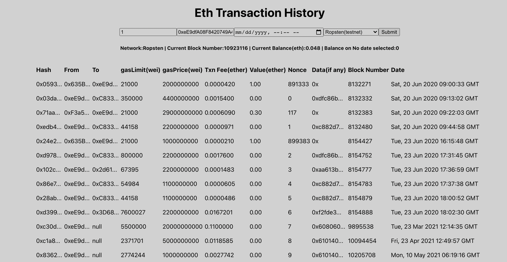
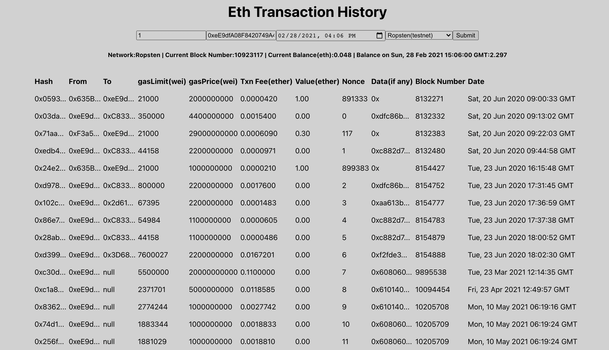

```
The repo has two folders eth-trans-app && eth-trans-server

Eth-trans-app is the frontend application that displays the transaction and communicate with our internal server i.e Eth-trans-server ,which is an express-node application that communicates with the ethereum network through infura
```


---
## First start the server

On your terminal, ```cd``` into eth-trans-app and do the following
1. Install the dependencies using ```yarn install```
2. Update ```.env``` with appropriate values
2. Start the server by running ```yarn serve```
3. The application will be available on port ```3020```


---
## Now start the Application

On your terminal, ```cd``` into eth-trans-app and do the following
1. Install the dependencies using ```yarn install```
2. Run ```yarn start```
3. The application should be running on the assigned port which should be ```3000``` or any other available ports
4. Enter the **block number** and **address** you're querying for on the application


## FEATURES

* Get all transaction records for an address since the genesis block or from a given block number
* Get current balance for an address
* Get amounts of ETH associated with transactions made to and from the given address

#### EXTRA FEATURES
* Get current balance of an address
* Get historical balance for an address at a given timestamp
* Supports Mainnet and Testnet


------------------
## APP SCREENSHOT

### Query without timestamp showing responses 


-----------------

### Query with timestamp showing responses 
